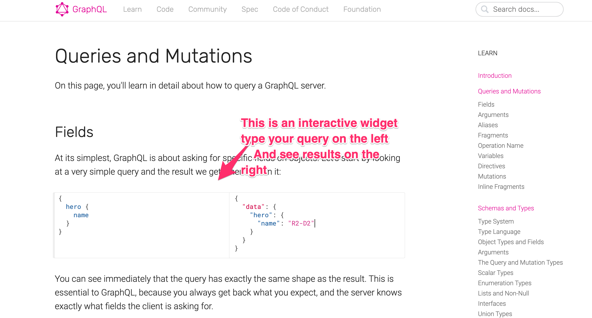

# DSL

## We need a way to Have a conversation with our Platform

1. Describe how to build things
2. What those things depend
3. What platforms they should be built with
4. Interact quickly

## We initially considered
1. Plain YAML or JSON files
2. A popular programnig Language like Python or Javascript
3. A stripped down Language like Bazel's modified Python
4. Using NIX since it's limited to only derivivg data
5. Performing REST queries
6. Writing our OWN DSL

## After experimentig chose, GraphQL. Why?
1. It represents graphs, a build system is a DAG which is a graph!
2. It has a powerful type system and Schemas
3. It's a description of a language only.. Implementation is left to authors
4. Many Frameworks exist to make implementing easy
5. Fronting REST API's is trivial
6. It supports queries, mutations and subscriptions (think interactive logs)
7. Finally it has a popular edit widgets... check out the graphql website. All the documentation is interactive. 

<kbd></kbd>

[Previous: Press Release](press-release.md) 
[Next: Press Release](user-guide/01-basics.md) 
